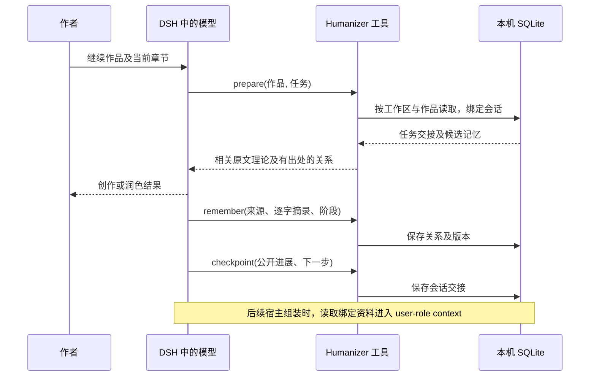

<!-- generated-by: gsd-doc-writer -->
# v0.4 工程结构

`index.mjs` 注册常驻写作引导及兼容的四个原工具。`lib/workbench.mjs` 注册 prepare、memory、checkpoint，并通过官方 `systemPrompt.context` 在每次组装时恢复资料。常驻引导在 system section，记忆在宿主动态 user-role context；不向系统指令拼接稿件摘录。

`lib/memory.mjs` 使用 Node 内置 SQLite。首次调用记忆工具才建库，Cordis scope 释放时关闭连接。WAL、busy timeout、BEGIN IMMEDIATE 事务协调独立进程串行提交，超时仍可能报锁冲突，修订/遗忘/进度更新还校验调用方观察到的版本。表结构版本为 1，不支持的版本拒绝使用；尚无旧数据库迁移需求。

数据表：projects 保存工作区内作品；bindings 保存会话选择的作品、当前任务与公开交接；heads 指向每个关系 key 的当前版本；records 保存带出处的历史版本。工作区取宿主 session.header.cwd 的 realpath，并对 Windows 路径大小写归一后哈希；不接受模型传来的文件路径。作品名和 key 全部作为 SQL 绑定值，绝不拼接进路径。

关系图直接由主体—关系—对象的断言生成，无外部图数据库。实体/属性字面匹配确定直接命中，再扩展一跳关系；置顶项参与候选，按关联强度排序。在完整 JSON 预算内逐条返回，不截断单条摘录，省略数量显式报告。它不会自动分词、识别别名或理解时间先后；可存别名边，故事时点明确标注但不推测排序。需要其他检索器时可替换 recall 而保留证据存储。

每个 key 新增不同断言时保留 conflict；revise 用观察到的当前版本替换为经核对的断言，历史不丢。遗忘清除该 key 的所有历史 payload，保留版本墓碑。数据库设置 secure_delete，但不承诺物理介质擦除、WAL 历史、系统备份或宿主日志删除。

prepare 对同作品同任务幂等；新任务继承最近可用的公开交接。新会话未选作品时没有记忆注入。自动资料只查询已绑定作品，配置关闭或插件卸载后移除贡献。读取失败给出不可用提示，避免导致整个宿主提示组装失败；不会假装记住。依旧需要模型实际调用工具保存资料，插件不被动抽取全部对话。

`lib/prepare.mjs` 按体裁/问题挑选相关章节全文；`lib/study.mjs` 保留完整 21 章。`lib/reference.mjs` 缓存只读原文，每次结果重新组装。`lib/guard.mjs` 是机械锚点/字符辅助检查，不是语义或文体评分器。`lib/client.js` 提供可编辑、可复制的请求模板；不连接数据库、不展示伪实时记录。

测试分三层：Node 单元测试验证存储与检索不变量；真实官方宿主服务+Session 验证工具、资料组装和 PTC；可安装 tarball 的隔离 Web Profile 验证安装、启动和移除。尚未通过真实付费模型执行小说生成闭环，质量验证按 EVALUATION.md 进行。

## 组件与职责

| 文件 | 职责 | 不负责的事 |
|---|---|---|
| [index.mjs](../index.mjs) | Config、常驻引导、四个兼容工具 | 不运行额外模型 |
| [workbench.mjs](../lib/workbench.mjs) | 三个新工具、会话身份、动态 context 生命周期 | 不被动抓取全部对话 |
| [memory.mjs](../lib/memory.mjs) | SQLite、版本、证据、图关系、召回预算 | 不验证世界事实或跨 key 语义矛盾 |
| [prepare.mjs](../lib/prepare.mjs) | 按体裁和 focus 选原始章节 | 不训练模型、不自动判定掌握程度 |
| [study.mjs](../lib/study.mjs) / [reference.mjs](../lib/reference.mjs) | 全库组装、章节缓存与小节查询 | 不读取用户任意文件 |
| [guard.mjs](../lib/guard.mjs) | 部分内容锚点与字符检查 | 不做完整语义核验 |
| [client.js](../lib/client.js) | 请求模板、编辑、复制反馈 | 不提供实时图谱编辑器或后端 RPC |

## 一次续写的数据流

流程中工具调用由模型决定。若模型没有调用保存工具，后续步骤不会自动补存；原有消息仍由 dsh 自己管理。完成 checkpoint 不会自动把 draft 变成 canon，也不会取消会话绑定。

## 隔离、交接与冲突的精确语义

工作区键由真实绝对路径哈希；作品名、关系 key 是参数化 SQL 数据。重命名作品会创建另一个作品名，移动工作目录会产生另一个工作区，当前没有迁移或重命名工具。隔离是查询范围限制，不是对同一操作系统用户的加密权限边界。

同会话、同作品、同任务重复 prepare 返回现有任务，不覆盖进度。新任务优先使用本会话同作品交接；否则取该作品按 updatedAt 排序的最近会话记录。并行写作的多个任务不会自动合并，作者需指定采用哪一份进度。

同 key 的候选按 subject、relation、target、kind、basis、stage、when 比较；来源或置顶状态不同本身不算内容矛盾。完全相同的重复写入不增加版本。revise 需要当前版本，并把当前候选替换为新的一个断言；旧版本继续存于 records。forget 清除该 key 所有版本正文，但不递归清理其他 key 和 bindings 中的引用。

## 当前工程取舍

召回会载入作品的当前记录并在内存做字面匹配；它不是面向无限规模图谱的索引服务。置顶加权不保证一定装入预算。故事时点只是标签，无时间排序或有效期推理。数据库 schema 版本为 1；识别到其他版本会拒绝使用，但构造器会先执行建表语句，不能把该检查理解成针对任意未来库的无写入探测。

后续可在保持证据与版本语义的前提下增加索引、别名整理和检索后端；这些不属于当前已实现功能。完整参数与错误见 [TOOLS](TOOLS.md)，发布闭环见 [DEVELOPMENT](DEVELOPMENT.md)。
